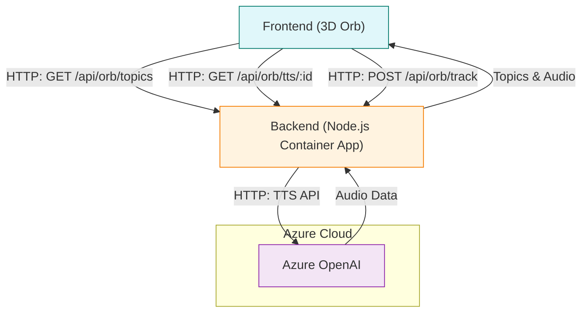

# AIMCS Backend with Orb Game & WebSocket Audio Support

This is the backend server for the AIMCS (AI Multimodal Customer System) featuring the new **Orb Game** interactive experience plus real-time WebSocket audio streaming capabilities.

## ⚠️ CRITICAL: Backend File Structure

**IMPORTANT: This repository contains BOTH frontend and backend code. Use the correct files for backend operations!**

### Backend-Specific Files

| File | Purpose | Usage |
|------|---------|-------|
| `backend-server.js` | **Main backend server** | Production API server for Azure Container Apps |
| `backend-package.json` | **Backend dependencies** | Copy to `package.json` for backend development |
| `backend-Dockerfile` | **Backend container** | Use for Docker builds |

### Common Backend Mistakes

❌ **DON'T**: Use `src/server.js` - this doesn't exist  
❌ **DON'T**: Use root `package.json` - this is for frontend  
❌ **DON'T**: Use root `server.js` - this is for frontend dev server  
✅ **DO**: Use `backend-server.js` for all backend operations  
✅ **DO**: Use `backend-package.json` for backend dependencies  
✅ **DO**: Use `backend-Dockerfile` for container builds  

### Backend Development Setup

```bash
# 1. Copy backend package.json
cp backend-package.json package.json

# 2. Install backend dependencies
npm install

# 3. Start backend server
node backend-server.js
```

### Backend Deployment

```bash
# Build backend container (uses backend-Dockerfile)
docker build -f backend-Dockerfile -t aimcs-backend:latest .

# Deploy to Azure Container Apps
az containerapp update --name aimcs-backend-eastus2 --resource-group aimcs-rg-eastus2 --image aimcsregistry.azurecr.io/aimcs-backend:latest
```

## 🚀 **Current Status**

**✅ DEPLOYED AND OPERATIONAL**

- **Backend URL**: https://aimcs-backend-eastus2.greenwave-bb2ac4ae.eastus2.azurecontainerapps.io
- **WebSocket Endpoint**: wss://aimcs-backend-eastus2.greenwave-bb2ac4ae.eastus2.azurecontainerapps.io/ws/audio
- **Region**: eastus2
- **Platform**: Azure Container Apps

## 🎮 **New Orb Game Features**

### Interactive 3D News Discovery
- **Topic Management**: Curated positive news content with categories
- **TTS Generation**: Azure OpenAI text-to-speech for all topics
- **Engagement Tracking**: User interaction analytics and scoring
- **Real-time Leaderboards**: Trending topics and user achievements

### Sample Topics Available
- 🤖 **Technology**: AI breakthroughs and innovations
- 🐠 **Science**: Amazing discoveries and research
- 🎨 **Art**: Creative expressions and cultural news
- 🐝 **Nature**: Environmental success stories
- 🚀 **Space**: Space exploration and discoveries
- 🎵 **Music**: Musical innovations and artists
- 🏃 **Sports**: Athletic achievements and records
- 💡 **Innovation**: Breakthrough technologies and ideas

## 🏗️ **Architecture**

```
┌─────────────────────────────────────────────────────────────┐
│                    AIMCS Backend (eastus2)                  │
├─────────────────────────────────────────────────────────────┤
│  Node.js Express Server                                     │
│  ├── HTTP API Endpoints                                     │
│  │   ├── GET /health                                        │
│  │   ├── GET /api/status                                    │
│  │   ├── GET /api/orb/topics                                │
│  │   ├── GET /api/orb/tts/:id                              │
│  │   ├── POST /api/orb/track                               │
│  │   ├── GET /api/orb/leaderboard                          │
│  │   └── POST /api/chat                                    │
│  └── WebSocket Server                                       │
│      └── WS /ws/audio                                       │
├─────────────────────────────────────────────────────────────┤
│  Azure Container Apps                                       │
│  ├── Auto-scaling (1-3 replicas)                           │
│  ├── Health monitoring                                      │
│  └── HTTPS/WSS support                                      │
└─────────────────────────────────────────────────────────────┘
```

### Orb Game Flow



**Flow Explanation:**
- The frontend loads topics from `/api/orb/topics`
- User clicks a topic satellite → requests TTS audio from `/api/orb/tts/:id`
- Backend generates audio via Azure OpenAI TTS
- User interaction tracked via `/api/orb/track`
- All communication with Azure services is via HTTP APIs from the backend

## 📡 **API Endpoints**

### HTTP Endpoints

| Endpoint | Method | Description | Response |
|----------|--------|-------------|----------|
| `/health` | GET | Health check | Status, uptime, connections |
| `/api/status` | GET | API status | Endpoints, active connections |
| `/api/orb/topics` | GET | Get available topics | Array of topic objects |
| `/api/orb/tts/:id` | GET | Generate TTS for topic | Base64 audio data |
| `/api/orb/track` | POST | Track user interaction | Success confirmation |
| `/api/orb/leaderboard` | GET | Get trending topics | Top topics by score |
| `/api/chat` | POST | Legacy chat API | Echo response for testing |

### WebSocket Endpoint

| Endpoint | Protocol | Description |
|----------|----------|-------------|
| `/ws/audio` | WSS | Real-time audio streaming |

## 🎮 **Orb Game API Details**

### Topic Object Structure
```javascript
{
  id: 1,
  category: "Technology",
  headline: "AI Breakthrough Helps Doctors Diagnose Diseases Faster",
  summary: "New artificial intelligence technology is revolutionizing healthcare...",
  createdAt: ISODate,
  score: 0
}
```

### TTS Response Structure
```javascript
{
  success: true,
  audioData: "base64_encoded_mp3_data",
  topic: { /* topic object */ }
}
```

### Track Interaction Request
```javascript
{
  id: 1,           // Topic ID
  action: "click",  // "click" or "listen"
  duration: 30      // Optional: seconds listened
}
```

## 🔌 **WebSocket Message Types**

### From Frontend to Backend

| Type | Payload | Description |
|------|---------|-------------|
| `test` | `{message: string, timestamp: string}` | Test connection |
| `audio` | `{data: base64, timestamp: string}` | Audio data stream |
| `ping` | `{}` | Keep-alive ping |

### From Backend to Frontend

| Type | Payload | Description |
|------|---------|-------------|
| `connection` | `{connectionId: string, message: string}` | Connection established |
| `test_response` | `{originalMessage: string, message: string}` | Test response |
| `audio_received` | `{dataSize: number, message: string}` | Audio acknowledgment |
| `pong` | `{timestamp: string}` | Ping response |
| `error` | `{message: string, error: string}` | Error message |

## 🚀 **Deployment**

### Prerequisites

1. **Azure CLI** installed and logged in
2. **Docker** installed and running
3. **Node.js** 18+ for local development

### Quick Deployment

```bash
# Make script executable
chmod +x deploy-backend.sh

# Deploy to Azure Container Apps
./deploy-backend.sh
```

### Manual Deployment Steps

1. **Build Docker Image**:
   ```bash
   docker build -f backend-Dockerfile -t aimcs-backend:latest .
   ```

## 🛠️ Recent Fixes: Azure OpenAI TTS & MongoDB Atlas SSL

### Azure OpenAI TTS (Text-to-Speech)
- Integrated Azure OpenAI TTS endpoint for topic audio generation.
- Uses deployment (e.g., `gpt-4o-mini-tts`) and API version `2025-03-01-preview`.
- Requires these environment variables:
  - `AZURE_OPENAI_TTS_DEPLOYMENT` (e.g., `gpt-4o-mini-tts`)
  - `AZURE_OPENAI_ENDPOINT` (e.g., `https://aimcs-foundry.cognitiveservices.azure.com/`)
  - `AZURE_OPENAI_API_KEY`
- Backend returns base64-encoded audio in `audioData` field.

### MongoDB Atlas SSL/TLS Connection
- Explicitly sets `tls: true` and `tlsAllowInvalidCertificates: false` in MongoClient options for robust Atlas SSL support.
- No longer uses deprecated `ssl`/`sslValidate` options.
- If running in Docker/Azure, ensure the container trusts the Atlas CA (see `atlas-ca.pem`).
- Dockerfile updated to copy `atlas-ca.pem` if needed.
- Troubleshooting: If you see SSL/TLS errors, verify your connection string, driver version, and CA trust settings.

### Example MongoClient Initialization
```js
this.client = new MongoClient(this.mongoUri, {
  tls: true,
  tlsAllowInvalidCertificates: false,
});
```

### Example TTS API Call
```js
const ttsResponse = await fetch(`${process.env.AZURE_OPENAI_ENDPOINT}openai/deployments/${process.env.AZURE_OPENAI_TTS_DEPLOYMENT}/audio/speech?api-version=2025-03-01-preview`, {
  method: 'POST',
  headers: {
    'Content-Type': 'application/json',
    'api-key': process.env.AZURE_OPENAI_API_KEY,
  },
  body: JSON.stringify({
    model: process.env.AZURE_OPENAI_TTS_DEPLOYMENT,
    input: aiResponse,
    voice: 'alloy',
    response_format: 'mp3',
    speed: 1.0
  })
});
```

## 🎯 **Testing Orb Game APIs**

### Test Topic Fetching
```bash
curl https://api.aimcs.net/api/orb/topics
```

### Test TTS Generation
```bash
curl https://api.aimcs.net/api/orb/tts/1
```

### Test Interaction Tracking
```bash
curl -X POST https://api.aimcs.net/api/orb/track \
  -H "Content-Type: application/json" \
  -d '{"id": 1, "action": "click"}'
```

### Test Leaderboard
```bash
curl https://api.aimcs.net/api/orb/leaderboard
```

## 🔮 **Future Enhancements**

### Planned Orb Game Features
- **Perplexity API Integration**: Live topic fetching from news sources
- **MongoDB Topic Storage**: Persistent topic database with user engagement
- **Achievement System**: Badges and milestones for user engagement
- **Personalization**: ML-based topic recommendations
- **Cross-site Learning**: User preferences that follow across websites

### Technical Improvements
- **Audio Caching**: Store generated TTS to reduce API calls
- **Rate Limiting**: Prevent abuse of TTS generation
- **Content Moderation**: Filter topics for positivity and appropriateness
- **Analytics Dashboard**: Real-time engagement metrics
- **Widget Embedding**: Easy integration for other websites